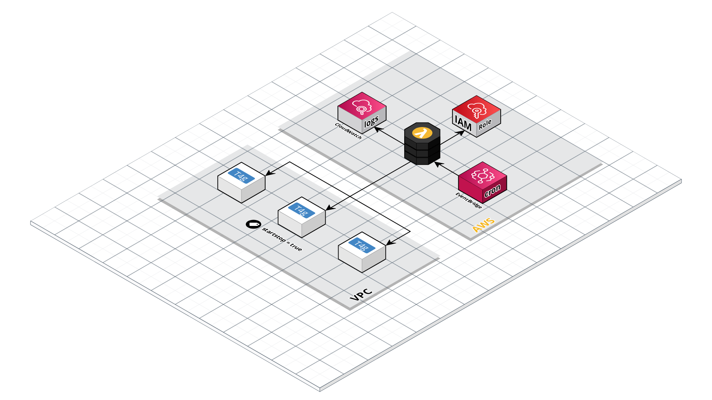

# ADV-IT Challenge solution



## Introduction
This is the solution of ADV-IT Challenge (vol. 2)

This config creates Lambda function and all needed surroundings including VPC and instances with tag which is being used as start/stop applied target marker.

## Usage
Basic usage of this config is as follows:
1. Open **variables.tf** file and modify default variables described below if needed
2. Apply config by:
```shell
terraform init
terraform apply
```

Alternatively you can leave **variables.tf** file as is but override default values by using Terraform syntax:
```shell
terraform init
terraform apply -var instance_type="t4g.micro"
```

<!-- BEGIN_TF_DOCS -->
## Requirements

| Name | Version |
|------|---------|
| <a name="requirement_terraform"></a> [terraform](#requirement\_terraform) | >= 1 |
| <a name="requirement_aws"></a> [aws](#requirement\_aws) | ~> 4 |

## Providers

| Name | Version |
|------|---------|
| <a name="provider_archive"></a> [archive](#provider\_archive) | n/a |
| <a name="provider_aws"></a> [aws](#provider\_aws) | ~> 4 |

## Modules

| Name | Source | Version |
|------|--------|---------|
| <a name="module_vpc"></a> [vpc](#module\_vpc) | terraform-aws-modules/vpc/aws | n/a |

## Resources

| Name | Type |
|------|------|
| [aws_cloudwatch_event_rule.action](https://registry.terraform.io/providers/hashicorp/aws/latest/docs/resources/cloudwatch_event_rule) | resource |
| [aws_cloudwatch_event_target.action](https://registry.terraform.io/providers/hashicorp/aws/latest/docs/resources/cloudwatch_event_target) | resource |
| [aws_cloudwatch_log_group.partitioning_lambda_log_group](https://registry.terraform.io/providers/hashicorp/aws/latest/docs/resources/cloudwatch_log_group) | resource |
| [aws_iam_instance_profile.server](https://registry.terraform.io/providers/hashicorp/aws/latest/docs/resources/iam_instance_profile) | resource |
| [aws_iam_policy.runner](https://registry.terraform.io/providers/hashicorp/aws/latest/docs/resources/iam_policy) | resource |
| [aws_iam_role.runner](https://registry.terraform.io/providers/hashicorp/aws/latest/docs/resources/iam_role) | resource |
| [aws_iam_role.server](https://registry.terraform.io/providers/hashicorp/aws/latest/docs/resources/iam_role) | resource |
| [aws_iam_role_policy_attachment.managed_role_for_lambda_attach](https://registry.terraform.io/providers/hashicorp/aws/latest/docs/resources/iam_role_policy_attachment) | resource |
| [aws_iam_role_policy_attachment.runner](https://registry.terraform.io/providers/hashicorp/aws/latest/docs/resources/iam_role_policy_attachment) | resource |
| [aws_iam_role_policy_attachment.ssm](https://registry.terraform.io/providers/hashicorp/aws/latest/docs/resources/iam_role_policy_attachment) | resource |
| [aws_instance.server](https://registry.terraform.io/providers/hashicorp/aws/latest/docs/resources/instance) | resource |
| [aws_lambda_function.runner](https://registry.terraform.io/providers/hashicorp/aws/latest/docs/resources/lambda_function) | resource |
| [aws_lambda_permission.allow_lambda_call](https://registry.terraform.io/providers/hashicorp/aws/latest/docs/resources/lambda_permission) | resource |
| [aws_security_group.server](https://registry.terraform.io/providers/hashicorp/aws/latest/docs/resources/security_group) | resource |
| [aws_security_group_rule.local_egress](https://registry.terraform.io/providers/hashicorp/aws/latest/docs/resources/security_group_rule) | resource |
| [aws_security_group_rule.local_ingress](https://registry.terraform.io/providers/hashicorp/aws/latest/docs/resources/security_group_rule) | resource |
| [archive_file.lambda_zip](https://registry.terraform.io/providers/hashicorp/archive/latest/docs/data-sources/file) | data source |
| [aws_ami.amazonlinux_arm](https://registry.terraform.io/providers/hashicorp/aws/latest/docs/data-sources/ami) | data source |
| [aws_caller_identity.current](https://registry.terraform.io/providers/hashicorp/aws/latest/docs/data-sources/caller_identity) | data source |
| [aws_iam_policy_document.runner](https://registry.terraform.io/providers/hashicorp/aws/latest/docs/data-sources/iam_policy_document) | data source |
| [aws_iam_policy_document.runner_role](https://registry.terraform.io/providers/hashicorp/aws/latest/docs/data-sources/iam_policy_document) | data source |
| [aws_iam_policy_document.server_role](https://registry.terraform.io/providers/hashicorp/aws/latest/docs/data-sources/iam_policy_document) | data source |
| [aws_region.current](https://registry.terraform.io/providers/hashicorp/aws/latest/docs/data-sources/region) | data source |

## Inputs

| Name | Description | Type | Default | Required |
|------|-------------|------|---------|:--------:|
| <a name="input_action"></a> [action](#input\_action) | Cron expression for start/stop time | `map(string)` | <pre>{<br>  "start": "cron(0 8 ? * MON-FRI *)",<br>  "stop": "cron(0 17 ? * MON-FRI *)"<br>}</pre> | no |
| <a name="input_aws_region"></a> [aws\_region](#input\_aws\_region) | AWS region to deploy to | `string` | `"us-east-1"` | no |
| <a name="input_environment_name"></a> [environment\_name](#input\_environment\_name) | Unique name of environment to be deployed | `string` | `"farm"` | no |
| <a name="input_half_cidr"></a> [half\_cidr](#input\_half\_cidr) | First part of VPC CIDR address | `string` | `"10.11"` | no |
| <a name="input_instance_type"></a> [instance\_type](#input\_instance\_type) | EC2 instance type. Should be Graviton based | `string` | `"t4g.small"` | no |
| <a name="input_instances_number"></a> [instances\_number](#input\_instances\_number) | How many EC2 instances will be created | `number` | `3` | no |
| <a name="input_permissive"></a> [permissive](#input\_permissive) | Gives more trust to Lambda. If set to false Lambda policy will be restricted only to instances created by this configuration. If true Lambda can operate all instances in current account | `bool` | `true` | no |
| <a name="input_profile"></a> [profile](#input\_profile) | Local AWS profile to use | `string` | `"default"` | no |
| <a name="input_tag"></a> [tag](#input\_tag) | Start/Stop tag | `map(string)` | <pre>{<br>  "startstop": "true"<br>}</pre> | no |
| <a name="input_tags"></a> [tags](#input\_tags) | Tags to be applied to all resources | `map(string)` | <pre>{<br>  "author": "Boris Gorbuntsov",<br>  "tag": "hola Denis",<br>  "task": "adv-it-challenge-2",<br>  "tool": "terraform"<br>}</pre> | no |
<!-- END_TF_DOCS -->

## Footer
Like! Subscribe! Touch the bell!  

