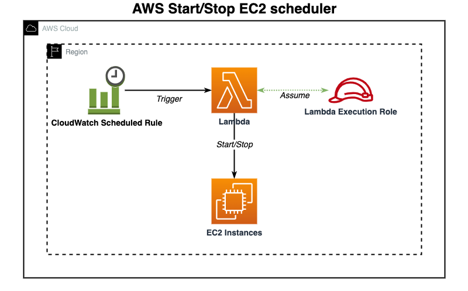

# AWS Start/Stop EC2 scheduler

## AWS Resources used

- CloudWatch Event - for scheduled rules
- Lambda           - for start/stop actions
- IAM              - to create lambda execution role

## Scheme

## Aditional info
- Author: [Yevhen Skyba](https://www.linkedin.com/in/yevhen-skyba/)
- E-mail: eugene.skiba@gmail.com